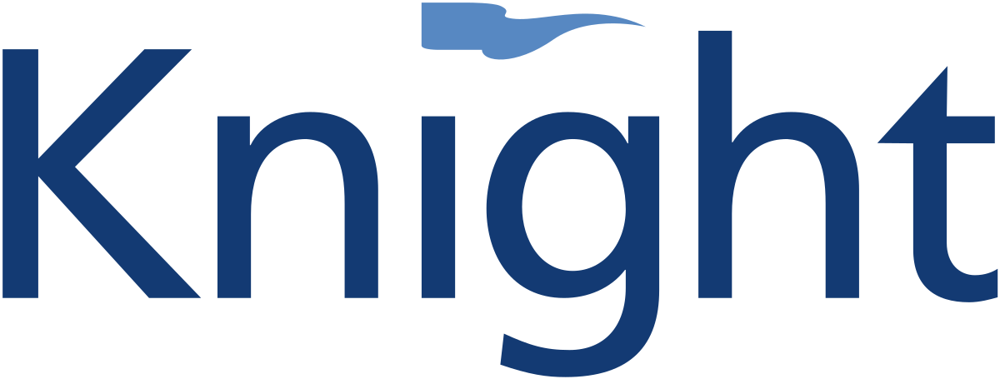
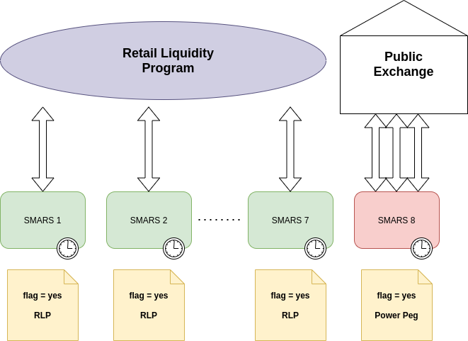
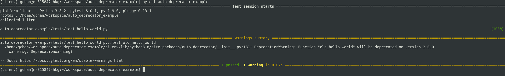
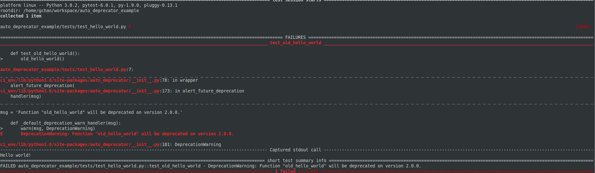
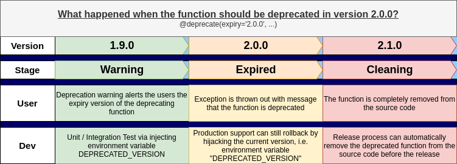
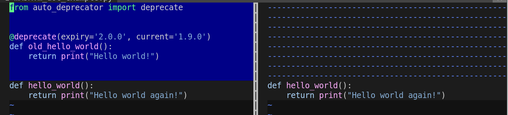
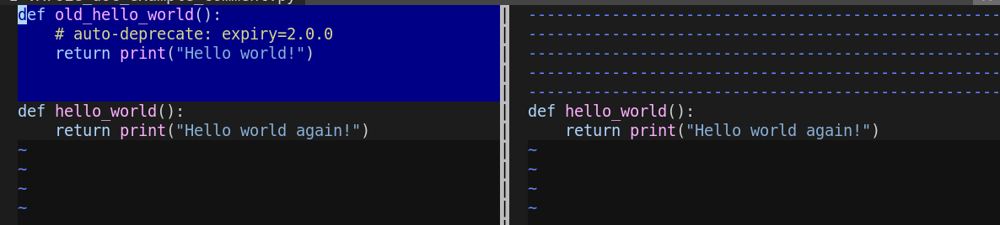

class: center, middle

# I can't believe it's still here!

## Gavin Chan

## Principal Quant Developer, AXA IM Chorus Ltd


---

# My Background

.center[

]

- Working as a principal quant developer in AXA IM Chorus Ltd, which
is a quantitative asset management firm.

- Python as a major language

- Worked in Fidessa as a C++ developer

- Personal Python open source projects: [BitcoinExchangeFH](https://github.com/BitcoinExchangeFH/BitcoinExchangeFH), [LightMatchingEngine](https://github.com/gavincyi/LightMatchingEngine)

---

# Case study - Knight Capital Group

.right[

]

- Knight Capital Group was the largest trader in U.S. equities in 2012

- Market making more than 19,000 US securities in more than 21 billion dollars average daily volume

- $1.4 billion revenue and $115.2 million net income in 2011

- A technical incident on August 1, 2012 costed Knight $440 million

- Finally, Knight was acquired by a rival, Getco LLC

---

# Background of the event

- The largest market Knight works on is the public market / exchange

- Knight competes with the financial services providing private markets / dark pools

- Since 2008, the dark pool trading rose from 15% to more than 40% of all stock trades

- In 2011, the NYSE proposed Retail Liquidity Program (RLP), its own dark pool

- After NYSE received SEC approval in end June, it quickly announced the RLP goes live 
in 1st August and Knight decided to participate the programme.

- Software development team needed to make changes on the existing trade execution system, Smart Market Access Routing System (SMARS), to support RLP, in 30 days

---

# Coding Horror

- SMARS routed the parent orders to the downstream execution between dozens of different trading venues

- The new RLP code in SMARS replaced some unused code, an order algorithm called "Power Peg", of the order router

- The algorithm "Power Peg" was not used in the live, production environment, but in a controlled environment for testing

- Power Peg, designed to buy high and sell low,  was already a "dead code" in the RLP deployment

- The new RLP code reuses a flag which activated the Power Peg previously. When the flag is set to "yes",
it activated the RLP functionality in the new SMARS but the Power Peg in the old SMARS

---

# Deployment Chaos

.center[

]

- In the week before go-live, an engineer manually deployed the new RLP code in SMARS to 7 out of 8 production servers

- However, the missing one was neither alerted or notified by other engineers

---

# Production Jungle

- On 1st August, 8:01 a.m., 97 emails of alerts "Power Peg disabled" were sent to the Knight personnel, but not as high-priority alerts and not reviewed by the staff

- At 9.30 a.m., RLP orders from broker-dealers were routed to Knight and the eighth server activated with the Power Peg algorithm started to continously send child orders, neglecting the parent orders

- By 9.34 a.m., NYSE noticed the doubled trading volume originated from Knight and alerted the CIO

- However, they could neither flipped the kill switch nor identified the root cause immediately 

- Until 9.58 a.m., the root cause was identified and the server was shut down.

---

# Nightmare

- Executed nearly 400 million shares with a net long position of $3.5 billion and a net short position of $3.15 billion.

- SEC refused to cancel most of the bogus trades and Knight had to settle those trades

- Knight had to close out the net positions and in estimate it costed Knight around $440 million

- A week later, Knight received $400 million cash infusion from investors. In end 2012, Knight was bought by Getco and combined as KCG Holdings.

---

# Ninja way to clean up the dead code

- Devote time for debt reduction and refactoring, e.g. 10% - 20% in every sprint

- Use version control smartly, for example in git

>> `git diff -G<keyword>`

>> `git log --after <date> --until <date>`

- Automated Testing and Test automation

---

# Imitation Learning

- Django

 * [Set a deprecation timeline](https://docs.djangoproject.com/en/dev/internals/deprecation/)

 * Test automation - Always show the deprecation warnings in unit testing

 >> `PYTHONWARNINGS=always pytest tests --capture=no`

- NumPy / scikit-learn: Add warning on the function docstring

- Numba: [Deprecation Notice in documentation](https://numba.pydata.org/numba-doc/latest/reference/deprecation.html)

- Tensorflow: Add compatibility API (e.g. `tf.compat.v1` and `tf.compat.v2`)

---

# Approach - Warning

- Documentation / Enhancement proposal: Alerts users and developers on the deprecation plan

- [Semantic Versioning](https://semver.org/) - MAJOR version when you make incompatible API changes

- Use `DeprecationWarning` - [PEP-565](https://www.python.org/dev/peps/pep-0565/#reference-implementation)

- Integrate with testing - `pytest ... -W error::DeprecationWarning`

.center[


]

---

# Approach - Expired and Cleaning

- Expired stage throws an exception on the application level if the function is called

- Provide a procedure for the users to work around in the expired stage

- Cleaning stage removes the deprecation part from the source code

---

# Auto-deprecator

.center[

]

---

# Auto-deprecator - Warning

- Specify the current version and the target expired version

```python
from auto_deprecator import deprecate

from hello_world import __version__

@deprecate(expiry='2.0.0', current=__version__)
def old_hello_world():
    return print("Hello world!")
```

```bash
(bash) hello-world-app
Hello world!
DeprecationWarning: Function "old_hello_world" will be deprecated in version 2.0.0
```

---

# Auto-deprecator - Warning

- Specify the current version by the package version and the migrated function

```python
from auto_deprecator import deprecate


@deprecate(expiry='2.0.0', version_module='hello_world', relocate='hello_world')
def old_hello_world():
    return 'hello world'
```

```bash
DeprecationWarning: Function "old_hello_world" will be deprecated on version 2.0.0. 
Please use function / method "hello_world"
```

---

# Auto-deprecator - Expired

Workaround of the exception in the production environment

```bash
(bash) hello-world-app --version
2.0.0
(bash) hello-world-app
Traceback (most recent call last):
 ...
 RuntimeError: Function "old_hello_world" is deprecated in version 2.0.0
(bash) DEPRECATE_VERSION=1.9.0 hello-world-app
Hello world!
```

It also means you can test the expired stage even the future version
is not yet released.

```bash
(bash) hello-world-app --version
1.9.0
(bash) DEPRECATE_VERSION=2.0.0 hello-world-app
Traceback (most recent call last):
 ...
 RuntimeError: Function "old_hello_world" is deprecated in version 2.0.0
```

---

# Auto-deprecator - Cleaning

- Command `auto-deprecate` removes the deprecated function from the source code

.center[

```
$ auto-deprecate hello_world.py --version 2.1.0
```





]

---

class: center, middle

### If you are interested to the project __auto-deprecator__, please visit [https://github.com/auto-deprecator/auto-deprecator](https://github.com/auto-deprecator/auto-deprecator)

### Github: [@gavincyi](https://github.com/gavincyi)

### Email: [gavincyi@gmail.com](https://bit.ly/2YFSm3F)

### Linkedin: [Gavin, Ying In Chan](https://www.linkedin.com/in/gavin-ying-in-chan-43b00127/)

---

### Reference

- https://www.henricodolfing.com/2019/06/project-failure-case-study-knight-capital.html
